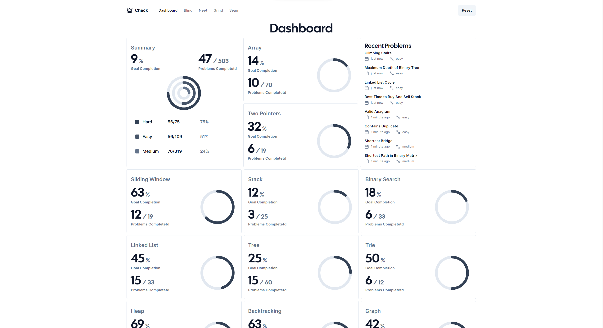

# Check

Personal tracker and recommender of algo practrice problems made with React/Nextjs, Tailwind and Radix UI

## Screenshot



## Run Locally

Clone the project

```bash
  git clone https://github.com/darkjoka/check.git
```

Go to the project directory

```bash
  cd check
```

Install dependencies

```bash
  npm install
```

Start the server

```bash
  npm run dev
```

## Acknowledgements

- [shadcn/taxonomy](https://github.com/shadcn/taxonomy)
